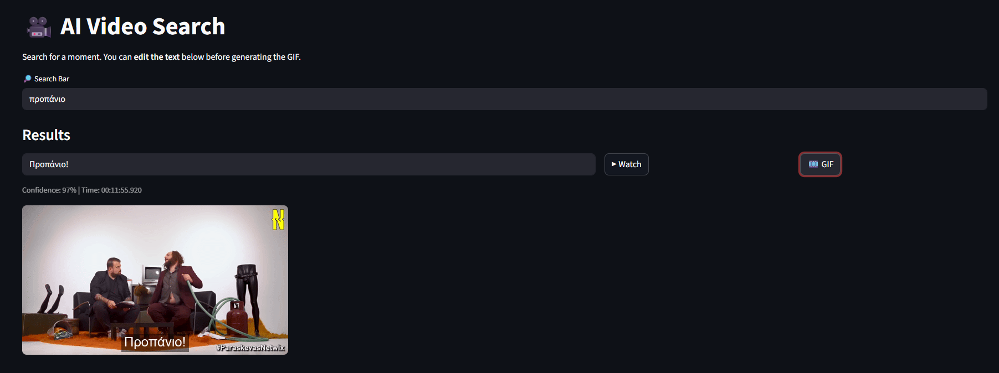

# Description

Download the subs of your favorite videos using the *download_subs.py* script.
The script transcribes greek audio if subs are not found using:
- youtube cookies from Mozilla Firefox browser
- ffmpeg for language and audio transcription

The app then searches for the input keywords and recognizes the best match using SentenceTransformer.
The user then can follow the link to the specified moment in the video and can create a GIF with the custom subs. 

## Installation

Download ffmpeg for Windows and include the executables in the folder.

## Running

Run **strimlit run app.py**

